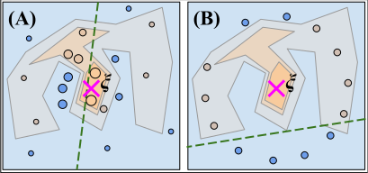

<center></center>


<table>
    <thead>
        <tr>
            <th>  </th>
            <th scope="col"></th>
            <th scope="col"></th>
        </tr>
    </thead>
    <tbody>
        <tr>
            <td>
                <a href="https://aaai.org/aaai-conference/"> AAAI Conference Link </a>
            </td>
            <td>
                <a href="https://github.com/rashidrao-pk/lime_stratified">LIME_Stratified</a>
            </td>
            <td>
                <a href="https://github.com/rashidrao-pk/lime-stratified-examples">LIME_Stratified Exampless</a>
            </td>
        </tr>
    </tbody>
</table>

# Lime-Stratified-Examples
- This Repositry contains codes to reproduce results for our publication <a href='https://doi.org/10.1609/aaai.v38i13.29397'><b>'Using stratified sampling to improve LIME Image explanations'</b></a> published at <b><a href='https://ojs.aaai.org/index.php/AAAI/index'> Proceedings of the AAAI Conference on Artificial Intelligence</b> </a> by Modifying <b>[Lime-Image](https://github.com/marcotcr/lime)</b> and by introducing a novel sampling stragtegy into LIME-Image. The proposed strategy merged with Orignal LIME and named as <a href='https://github.com/rashidrao-pk/lime_stratified' ><b> LIME_STRATIFIED</b></a>. 

- The Effect of introducing this sampling stratgey is presented in `Results` Section and can be validated by running codes in next few sections.


<h1> Using Stratified Sampling to Improve LIME Image Explanations </h1>


## Paper PDF:
Paper can be found at [LINK](https://ojs.aaai.org/index.php/AAAI/article/view/29397) and also on <a href=''> <a href = 'https://arxiv.org/abs/2403.17742'>  </a>
</a>.

### Authors ✍️

| Sr. No. | Author Name | Affiliation | Google Scholar | 
| :--:    | :--:        | :--:        | :--:           | 
| 1. | Muhammad Rashid | University of Torino, Computer Science Department, C.so Svizzera 185, 10149 Torino, Italy | [Muhammad Rashid](https://scholar.google.com/citations?user=F5u_Z5MAAAAJ&hl=en) | 
| 2. | Elvio G. Amparore | University of Torino, Computer Science Department, C.so Svizzera 185, 10149 Torino, Italy | [Elvio G. Amparore](https://scholar.google.com/citations?user=Hivlp1kAAAAJ&hl=en&oi=ao) | 
| 3. | Enrico Ferrari | Rulex Innovation Labs, Rulex Inc., Via Felice Romani 9, 16122 Genova, Italy | [Enrico Ferrari](https://scholar.google.com/citations?user=QOflGNIAAAAJ&hl=en&oi=ao) | 
| 4. | Damiano Verda | Rulex Innovation Labs, Rulex Inc., Via Felice Romani 9, 16122 Genova, Italy | [Damiano Verda](https://scholar.google.com/citations?user=t6o9YSsAAAAJ&hl=en&oi=ao) |


### Paper contribution 📃
In this paper we:
- investigate the distribution of the dependent variable in
the sampled synthetic neighborhood of LIME Image,
identifying in the undersampling a cause that results in
inadequate explanations;
- delve into the causes of the synthetic neighborhood inad-
equacy, recognizing a link with the Shapley theory;
- reformulate the synthetic neighborhood generation using
an unbiased stratified sampling strategy;
- provide empirical proofs of the advantage of using strat-
ified sampling for LIME Image on a popular dataset.


### 🔧 Dependencies and Installation
- Python
- Tensorflow
- Option: NVIDIA GPU + CUDA

Install all the required libraries by running following line:

```
git clone https://github.com/rashidrao-pk/lime-stratified-examples/
cd /lime-stratified-examples
git clone https://github.com/rashidrao-pk/lime_stratified
pip install -r requirements.txt 

```

### Structure of the artifact 💻

This artifact is structured as follows:

- the [`data/`](https://github.com/rashidrao-pk/lime-stratified-examples/tree/main/data) folder contains a subset of the [ImageNet Object Localization Challenge](https://www.kaggle.com/competitions/imagenet-object-localization-challenge/data) (the first 150 images) used to generate the plots and benchmarks of the paper;

- the [`lime_stratified/`](https://github.com/rashidrao-pk/lime_stratified) that contains a modified version of <b>[LIME](https://github.com/marcotcr/lime)</b> with the proposed stratified sampling approach.

- the [`results/`](https://github.com/rashidrao-pk/lime-stratified-examples/tree/main/result) folder, which contains the results after running the artifact.

- two notebooks:

  * [`Run_Benchmark.ipynb`](https://github.com/rashidrao-pk/lime-stratified-examples/blob/main/Run_Benchmark.ipynb) runs the (long) benchmark on a subset of the <b>ImageNet Object Localization Challenge</b>, generating the CSV file in the [`results/`](https://github.com/rashidrao-pk/lime-stratified-examples/tree/main/result)  folder. 
  Inside the file there is an option to also run a "simplified" version of the benchmark (just one image) instead of the "full" version. The simplified version will run all the steps, but on a single image.

  * [`Paper_Figures.ipynb`](https://github.com/rashidrao-pk/lime-stratified-examples/blob/main/Paper_Figures.ipynb) which reads the CSV file and generates the plots included in the paper.

The [precomputed CSV](https://github.com/rashidrao-pk/lime-stratified-examples/blob/main/result/precomputed_results_1000_1_150_%5B50%2C%20100%2C%20150%2C%20200%5D.csv) file is already included in the `results/` folder.

---
## How to run the artifact 📊


1. The [`Run_Benchmark.ipynb`](/Run_Benchmark.ipynb.ipynb) will take a long tame (more than 1 day) to run all the experiments and generate the CSV file. All explanations are computed 10 times and then averaged, to better stabilize the results and reduce randomization.

2. The [`Paper_Figures.ipynb`](/Paper_Figures.ipynb) has several targets: for the single explanations, it will take a few minutes. For the plots generated starting from the [CSV](/result/filename?.csv) file, in will take a few seconds.


## Performance Measures to Evaluate Image Explanations: 🎯
<b>How can we evaluate an XAI method for images? to decide the quality of an explanation</b><br>
we have utilised few evaluation metrices to quantify the base Lime-Image approach and lime_stratified approach including.
1. Visual Evaluation (Heatmaps for explanation)
2. Statistical Evaluation
    - Coeffecient of Variation $(CV(\beta))$
    - Inter-Quantile Range Coverage $(RC\_Y)$
    - $R_2$ Score from Explanations
## Cite
If you use our proposed strategy, please cite us: <br>
``` 
Rashid, M., Amparore, E. G., Ferrari, E., & Verda, D. (2024). Using Stratified Sampling to Improve LIME Image Explanations. Proceedings of the AAAI Conference on Artificial Intelligence, 38(13), 14785-14792. https://doi.org/10.1609/aaai.v38i13.29397 
```

## Motivation behind lime-stratified 💪

How LIME Image supposed to work and how does it actually works



## Workflow of LIME Image
We breifly overview and the Workflow of LIME Image is presented in the following figure.


### Keywords 🔍

XAI · LIME · Stratified Sampling . ML: Transparent, Interpretable, Explainable ML, RU: Stochastic Optimization, SO: Sampling/Simulation-based Search


### Repositry Details:


      <a href ="https://github.com/DmitryRyumin/lime-stratified-examples/blob/main/LICENSE">
        
      </a>
<a href="https://github.com/rashidrao-pk/">

</a>

      <a href="https://github.com/rashidrao-pk/">
        
      </a>


<a href="https://github.com/rashidrao-pk/lime-stratified-examples/graphs/contributors">

</a>
<a href="https://github.com/rashidrao-pk/lime-stratified-examples/issues?q=is%3Aissue+is%3Aclosed">

</a>
<a href="https://github.com/rashidrao-pk/lime-stratified-examples/issues">

</a>
<a href="https://github.com/rashidrao-pk/lime-stratified-examples/pulls?q=is%3Apr+is%3Aclosed">

</a>
<a href="https://github.com/rashidrao-pk/lime-stratified-examples/pulls">

</a>


<a href="https://github.com/rashidrao-pk/lime-stratified-examples/watchers">

</a>
<a href="https://github.com/rashidrao-pk/lime-stratified-examples/forks">

</a>
<a href="https://github.com/rashidrao-pk/lime-stratified-examples/stargazers">

</a>
